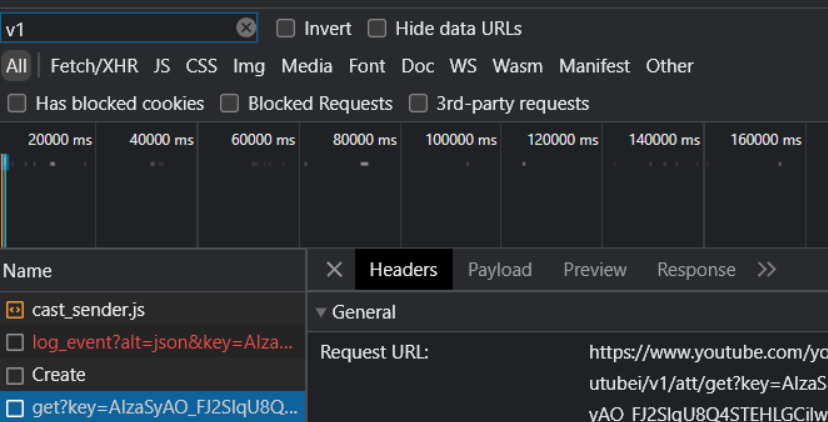
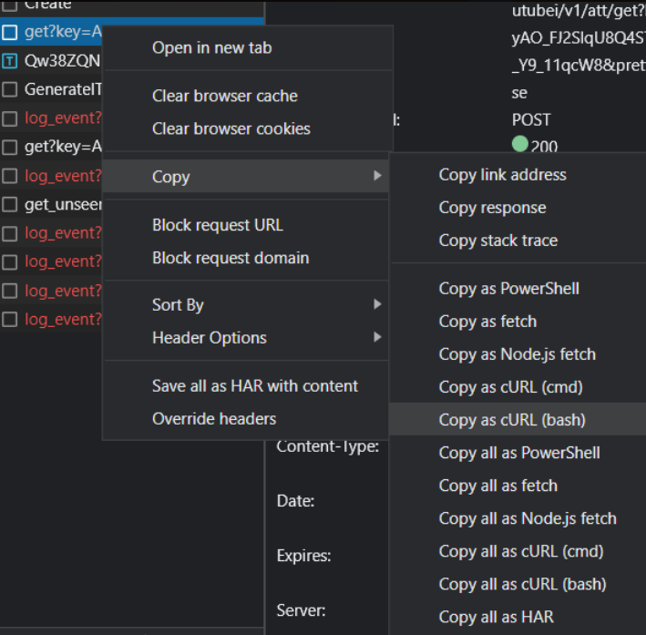

# Python Youtube Downloader
supports:
* age restricted videos (with and without user details)
* playlists
* searching
* downloading hls/dash manifests
* specific itags
* all requests made with asynchronous aiohttp with a single session, ensuring the fastest connections
* trimming start and end position of the video (time to byte range to avoid downloading entire video yet to come, i just cant find any code that does this)
* integratability with api's
## Usage:
### First time setup:
#### 1. in command prompt
    git clone https://github.com/Hecker5556/ytdownloader.git
#### 2. 
    cd ytdownloader
#### 3. if you haven't already, [install python](https://www.python.org/)
 this will download requirements, build exe and add to path (admin needed which will be asked almost on launch)
    python setup.py build

 on linux this will add absolute path to PATH and chmod the file, it will print out what u need to use to execute, it will also write to usagecommand.txt incase u forgor

 If you built and added to path, you can replace 'python ytdownload.py' with just `ytdownload`, make sure to open a new terminal
#### if you don't want to build, just run
    pip install -r requirements.txt
## usage
```
usage: ytdownload.py [-h] [--search SEARCH] [--verbose] [--manifest] [--maxsize MAXSIZE] [--premerged] [--codec CODEC] [--nodownload]
                     [--priority PRIORITY] [--audioonly] [--mp3audio] [--itag ITAG] [--onlyitag] [--file-name FILE_NAME] [--start START]
                     [--end END] [--overwrite] [--returnurlonly] [--proxy PROXY]
                     [link]

download youtube videos in different ways, file sizes

positional arguments:
  link                  link to a youtube video

options:
  -h, --help            show this help message and exit
  --search SEARCH, -se SEARCH
                        search for a youtube video with the input
  --verbose, -v         print out connections, information, checks if signatre deciphering is working
  --manifest, -m        whether to download videos from video manifest (ios)
  --maxsize MAXSIZE, -s MAXSIZE
                        maximum size in mb, may go over
  --premerged, -p       whether to download premerged versions only (720p, 360p, 144p 3gpp)
  --codec CODEC, -c CODEC
                        which video codec to download, has to be one of these ['vp9', 'avc1', 'av01', None] (if you dont know what this is, vp9    
                        is webm, avc1 is mp4, av01 is new type of mp4 that may not work on many platforms)
  --nodownload, -nd     doesnt download, only gets all the information and stores in links.json and otherinfo.json
  --priority PRIORITY, -pr PRIORITY
                        prioritize video/audio quality. accepted argument: ["video", "audio", "none"], if none, will pair similar qualities        
  --audioonly, -a       whether to only extract audio and return in mp3 format
  --mp3audio, -mp3      when downloading audio only, whether to convert it to mp3
  --itag ITAG, -i ITAG  download that specific itag and automatically pair audio to it
  --onlyitag, -oi       whether to only download the itag provided
  --file-name FILE_NAME, -f FILE_NAME
                        set output filename
  --start START, -st START
                        at what timestamp should the video start? MM:SS or HH:MM:SS
  --end END, -e END     at what timestamp should the video end? MM:SS or HH:MM:SS
  --overwrite, -ow      overwrites video if a video with the same title already exists
  --returnurlonly, -url
                        returns only the url
  --proxy PROXY         use proxy for all connections
  ```
  ## python usage
you can get a few examples in the tests.py file of how to use this
  ## age restricted videos
  if you want to download age restricted videos/videos only your account can see, you'll need to follow these instructions:
  ### 1. open developers tab on a browser (ctrl+shift+i)
  ### 2. go to network traffic 
  
  ### 3. go to the age restricted video (if network tab closes or something, just open it up again and refresh page)
  ### 4. search up v1 and find a request with this url
  
  ### 5. right click and select 'copy as curl (bash/POSIX)
  
  ### 6. head to [curl converter](https://curlconverter.com/) and paste
  ### 7. using the cookies and headers you recieved, run 
    python createenv.py
  ### and fill in the details it asks for 
  ### And you're Done!
  
  ## How to uninstall
  ### you can simply run 
    python uninstall.py
   and depending on platform, will remove from path, remove built files (if windows) and will ask if you also want to delete the whole directory