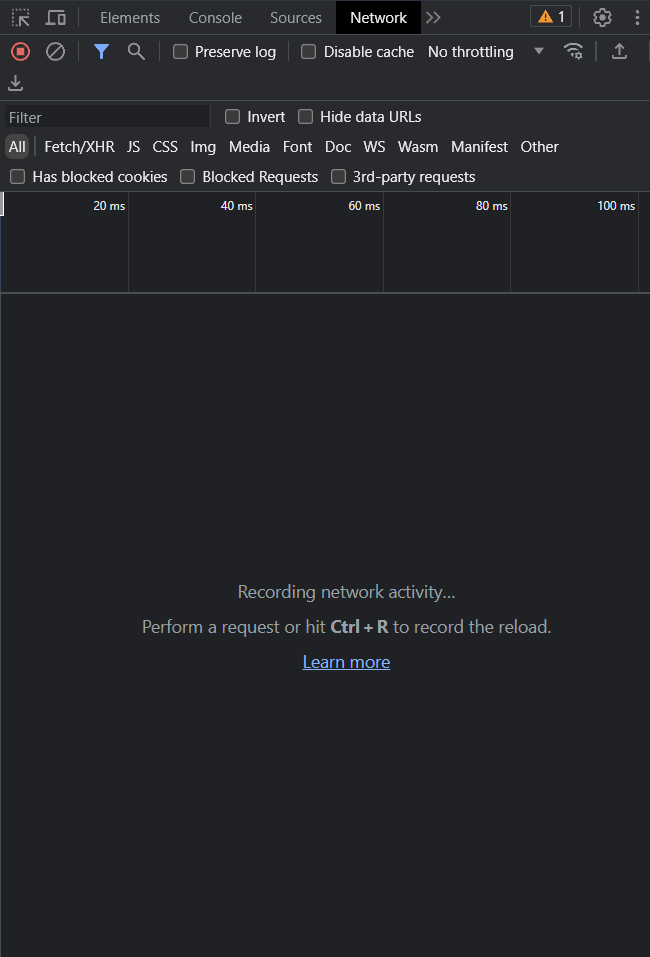

# Python Youtube Downloader

## Usage:
### First time setup:
#### 1. in command prompt
    git clone https://github.com/Hecker5556/ytdownloader.git
#### 2. 
    cd ytdownloader
#### 3. if you haven't already, [install python](https://www.python.org/)
### this will download requirements, build exe and add to path (admin needed which will be asked almost on launch)
    python setup.py build
### on linux this will add absolute path to PATH and chmod the file, it will print out what u need to use to execute
#### If you built and added to path, you can replace 'python ytdownload.py' with just `ytdownload`, make sure to open a new terminal
#### if you don't want to build, just run
    pip install -r requirements.txt
## usage
```
python ytdownload.py [link] [options]

options:
  -h, --help            show this help message and exit

  --verbose, -v         print out connections, information, checks if signatre deciphering is working

  --manifest, -m        whether to download videos from video manifest (ios)

  --maxsize MAXSIZE, -s MAXSIZE
                        maximum size in mb, may go over

  --premerged, -p       whether to download premerged versions only (720p, 360p, 144p 3gpp)

  --codec CODEC, -c CODEC
                        which video codec to download, has to be one of these ['vp9', 'avc1', 'av01', None] (if you dont know what this is, vp9 is webm,   
                        avc1 is mp4, av01 is new type of mp4 that may not work on many platforms)

  --no-download, -nd    doesnt download, only gets all the information and stores in links.json and otherinfo.json

  --priority PRIORITY, -pr PRIORITY
                        prioritize video/audio quality when downloading under filesize. accepted argument: ["video", "audio", "none"], if none, will pair similar qualities, video by default

  --audio-only, -a      whether to only extract audio 

  --mp3-audio, -mp3     when downloading audio only, whether to convert it to mp3
  ```
  ## age restricted videos
  ### if you want to download age restricted videos/videos only your account can see, you'll need to follow these instructions:
  ### 1. open developers tab on a browser (ctrl+shift+i)
  ### 2. go to network traffic 
  
  ### 3. go to the age restricted video (if network tab closes or something, just open it up again and refresh page)
  ### 4. search up v1 and find a request with this url
  
  ### 5. right click and select 'copy as curl (bash/POSIX)
  
  ### 6. head to [curl converter](https://curlconverter.com/) and paste
  ### 7. using the cookies and headers you recieved, run 
    python createenv.py
  ### and fill in the details it asks for 
  ### And you're Done!
  
  ## How to uninstall
  ### you can simply run 
    python uninstall.py
  ### and depending on platform, will remove from path, remove built files (if windows) and will ask if you also want to delete the whole directory